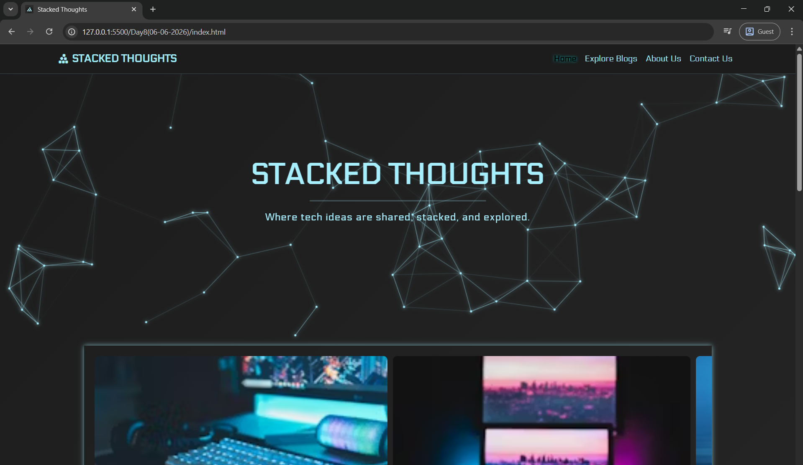

# Bootstrap Blog Template

A simple responsive blog template built using Bootstrap 5, featuring a navbar, blog post cards, and a footer with social icons. This project demonstrates the use of Bootstrap’s grid system, utility classes, and components to create a clean, mobile-friendly blog layout.

[Live Demo Link](https://archiep27.github.io/StackedThoughts-BootStrapDesign/)

---

## Features

1. **Bootstrap CSS and JS CDN**  
   Includes Bootstrap 5 CSS and JS via CDN for fast and easy setup.

2. **Responsive Navbar**  
   A navbar with brand name and navigation links styled using Bootstrap classes.

3. **Blog Post Cards**  
   A container holding multiple cards, each representing a blog post with image, title, description, and a "Read More" button.

4. **Bootstrap Grid Layout**  
   Cards arranged responsively using Bootstrap grid to look great on all screen sizes.

5. **Footer with Social Icons**  
   A footer section featuring social media icons for user engagement.

6. **Customization**  
   Spacing and colors customized using Bootstrap utility classes.

7. **Responsive Design**  
   Fully tested and optimized for different screen sizes — mobile, tablet, and desktop.

---

## How to Use

1. Clone or download this repository.
2. Open `index.html` in any modern browser.
3. Customize content, images, and links as needed.
4. Use the Bootstrap utility classes to modify styles quickly.

---

## External Resources & References

- [🔷 Bootstrap 5 CSS CDN](https://cdn.jsdelivr.net/npm/bootstrap@5.3.3/dist/css/bootstrap.min.css)  
- [🟦 Bootstrap 5 JS Bundle CDN](https://cdn.jsdelivr.net/npm/bootstrap@5.3.3/dist/js/bootstrap.bundle.min.js)  
- [📘 Bootstrap Docs](https://getbootstrap.com/docs/5.3/getting-started/introduction/)  
- [🎨 Font Awesome CDN](https://cdnjs.com/libraries/font-awesome)  
- [🧩 Font Awesome Icons](https://fontawesome.com/icons)  
- [🔡 Google Fonts](https://fonts.google.com/)  
- [🖼️ Unsplash - Free Images](https://unsplash.com/)  

---

## License

This project is open source and free to use.

---

Feel free to contribute or customize this template to suit your needs!

---

